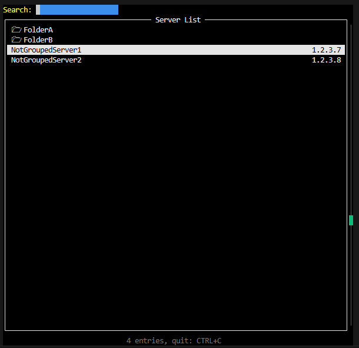

# ssh-prompter

The source of this project is https://git.azlux.fr/azlux/ssh-prompter, **PR are accepted on the source only**.

ssh-prompter lists all servers contained in your ssh_config file with search feature and connect directly to it.

Entirely based on ssh config file, it's standalone without any database.

Additionally, the script can scan others `Include` [ssh_config file if used](https://man.openbsd.org/ssh_config#Include).

This is a new version of this old script, rewrited in Go.

### Screenshot


## Installation
### Via APT (recommended)
See [http://packages.azlux.fr](http://packages.azlux.fr)

```bash
echo "deb [signed-by=/usr/share/keyrings/azlux-archive-keyring.gpg] http://packages.azlux.fr/debian/ bookworm main" | sudo tee /etc/apt/sources.list.d/azlux.list
sudo wget -O /usr/share/keyrings/azlux-archive-keyring.gpg  https://azlux.fr/repo.gpg
sudo apt update
sudo apt install ssh-prompter
```

### Manually
You need to install the [Go Language](https://go.dev/doc/install)

Then you can build the project
```bash
git clone https://github.com/azlux/ssh-prompter.git
cd ssh-prompter
go build
```

## Configuration
### Alias
Many people don't like the long command `ssh-prompter` so I recommand to put an alias into your `~/.profile` or `~/.bashrc`.
It's safe to replace the `ssh` command since I don't interfere with ssh if additionnals parameters are used.
```bash
# alias ssh="ssh-prompter"
# or
# alias sshp="ssh-prompter"
```

### SSH config configuration
Everything is here : [Official ssh_config manual](https://man.openbsd.org/ssh_config)
I don't have a custom config file, neither a database. 

This program parse the standard ssh config file. See [the example](examples/config) for a basic config for ssh

### Folder
SSH-Prompter manage folder.
Host will be group by `Folder` when no search.

Two methods:
- The Host name can be `FolderName/Name`, 
- You can add the ssh config option `Folder FolderName`.
  - In this case you need `IgnoreUnknown Folder`on the TOP of your `.ssh/config` file (to avoid error).

You can use both (but not in the same time for the same Host) !

### Additionnal information
All Host with `*` are ignored.

I consider we don't want to "select" them since it's a wildcard for other hosts

### Why two methods for folder :
I first wanted to have the `/` (slash) method but when you use ProxyJump, ssh don't allow slash into the name.
So the option `Folder` is here to allow having a proxy server into a folder.

### TMUX
If you run the script on a tmux.
The window will be renamed with the Host selected.

It use the command `tmux rename-window xxxxx`
